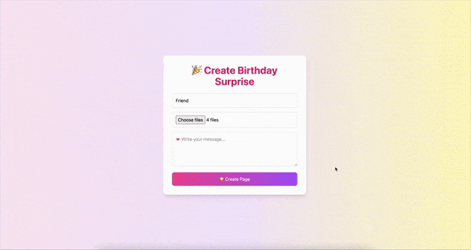

# 🎂 HappyPage – The Cutest Birthday Surprise Ever 💖🎁

🌟 *Make birthdays unforgettable!* 🌟 
A magical and interactive birthday wish generator built with **Python Flask** and **Tailwind CSS**.  
Create a unique link for your loved ones filled with: ✨ Memories, 🎂 Virtual Cake Cutting, 💡 Surprises, and 💌 Heartfelt Messages.

---

## 🌟 Features
- 🎀 **Mirror of Memories** – Unlock the magic with a single click.
- 📸 **Memory Carousel** – Relive beautiful moments in a smooth slideshow.
- 🎂 **Cake Cutting Animation** – A fun virtual cake-cutting experience.
- 💡 **Light Up Surprise** – Watch as the screen lights up with joy.
- 💌 **Heartfelt Message** – A customized message to make their day extra special.
- 🎁 **Shareable Link** – Send your personalized page link to friends 
- 📱 **Globally Shareable Link** – Share via link or QR code.
---

## 🚀 Demo
✨ [Live Demo Here](https://happypage.onrender.com)

---

## ❤️ Screenshots

🌸 Mirror of Memories



🎂 Cake Cutting Page
(Insert screenshot here)

💡 Light Up My Life
(Insert screenshot here)

### 🎂 Cake Cutting


### 💡 Light Up My Life


### 🌈 Full Flow

---

## 📦 Tech Stack
- **Backend**: Python Flask 🐍
- **Frontend**: Tailwind CSS 🌸, HTML5
- **Animations**: Custom CSS, Tailwind Transitions
- **Deployment**: Render 🌍

---
## 📁 Folder Structure
````markdown
HappyPage/
│
├── static/                        # 🍭 Static assets
│   └── uploads/                   # 📸 User uploaded photos
│
├── templates/                     # 📝 HTML Templates
│   ├── index.html                 # 🎀 Homepage form
│   ├── share.html                 # 🔗 Shareable link page
│   ├── page1.html                 # 💕 Mirror of Memories
│   ├── page2.html                 # 📸 Memory Carousel
│   ├── page3.html                 # 🎂 Cake Cutting
│   └── page4.html                 # 💡 Light Up My Life
│
├── app.py                         # 🐍 Flask backend logic
├── requirements.txt               # 📦 Python dependencies
├── Procfile                       # 🚀 Tells Render/Heroku how to run app
└── README.md                      # 📘 Project overview & setup guide
````
---

📸 Memory Carousel

🎂 Cake Cutting Animation

💡 Light Up My Life

🎉 Full Journey (All Pages)

### ✨ Author
Created with ❤️ by Trishna Paswan

📧 Feel free to reach out for collaborations!
